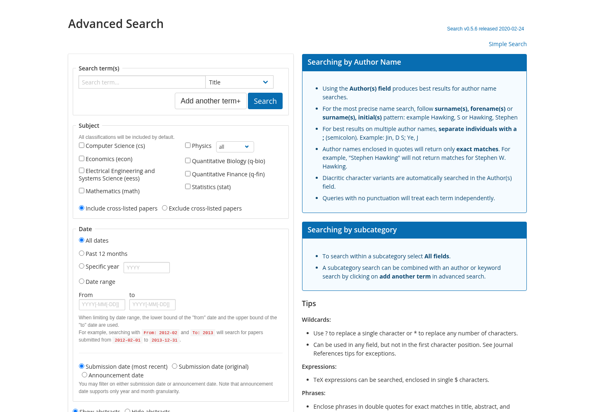

# Visual packaging regression

Native amd64 Chromium checks used 1440×1000 and 1280×800. Reports are
`verification/arxiv-visual-regression.json` and
`verification/arxiv-search-abstract-visual.json`. Saved official HTML provides
the comparison content; live websites were not contacted from test browsers.

The advanced-search content region retained the same controls and measured boxes
as the saved official form at both viewports. The pair below deliberately hides
header/footer on both sides to compare the form across archived website eras.
It is not evidence of a full-page pixel match.

| Packaged form | Saved official form with archived-era local styles |
|---|---|
|  |  |

The archived task search-result state matched measured boxes and visible text
at both viewports. Those screenshots are retained in author-side evidence,
not published here because they contain task-specific result lists.

Abstract-page measurements match the previous local implementation. Compared
with the official archive, the submission history omits sender identity and PDF
sizes, which are not present in the metadata snapshot. Version timestamps remain
visible. The excluded source-download entrance uses “Other formats”; its sidebar
is 1.375 pixels taller. Citation modal keyboard focus, Escape/return focus,
unsupported-service handling and MathJax toggling passed (13 formulas in the
chosen mathematical abstract). No missing supported-page resources were found.

Homepage/archive/year content retains the previous local controls and measured
geometry, while differing from the saved official page in spacing and metadata
presentation. Month-list first-entry geometry and the entire list height match
the prior local rendering; the main wrapper height differs by about 14.6 pixels
at 1440 width. These retained differences are recorded, not labeled perfect
replication. The supported controls matched the official references in all ten
content-region comparisons, with no local blocked or failed resource requests.

Census and Wateroffice retain their separately documented visual differences;
this release work does not upgrade them to pixel-equivalent replicas. NOAA's
chart-dependent visual install is unavailable without its excluded dependency.
